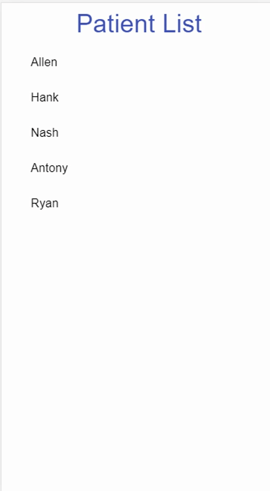

# node-react-patient

[requirement document](https://docs.google.com/document/d/1sAmgxU690KNfm8VdILZwRYfseE1D2IO7ACw0tBLQHGE/edit)

專案架構: 參考[StephenGrider/FullstackReactCode](https://github.com/StephenGrider/FullstackReactCode)

## Demo

- 增加醫囑



---

- 編輯醫囑


---

- 刪除醫囑


## How to run

```bash
cd src
# npm install server package
npm i
# ---------
cd client
# npm install client package
npm i
# ---------
cd ..
# open server and client dev server
npm run dev
```

> server: http://localhost:8080
> client: http://localhost:8081

## document

- [API doc](./API.md)

## Todo List

- [x] 前端React， 使用react hooks(state)進行資料保存
- [ ] 前端React資料的存取，採用react hook或redux均可，不限制
- [ ] 前端採用MaterialUI(https://material-ui.com)為基礎元件，進行製作
- [x] 後端採用Nodejs + Express
- [x] 後端資料庫採用MongoDB
- [x] 住民為固定，醫囑可新增編輯
  - [x] 住民為固定
  - [x] 醫囑可新增編輯

## Env

- node version: 12.18.3
- [MongoDB server](https://www.mongodb.com/), sign in and create DB
